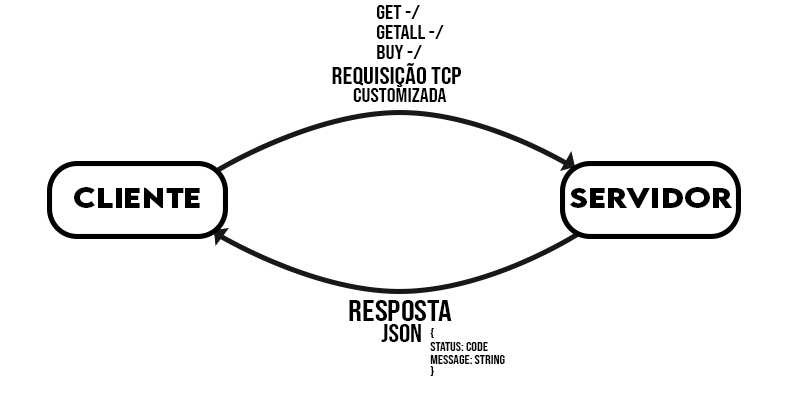

# VendePass

Problema 1 da matéria TEC502 - Concorrência e Conectividade

### Sumário

- [Como Executar](#como-executar-a-solução)
- [Introdução](#introdução)
- [Produto Desenvolvido](#produto-desenvolvido)
- [Arquitetura da Solução](#arquitetura-da-solução)
- [Protocolo de Comunicação](#protocolo-de-comunicação)
- [Conexões e Dados](#conexoes-e-dados)
- [Gerenciamento da Aplicação](#gerenciamento-da-aplicacao)
- [Desempenho e Confiabilidade](#desempenho-e-confiabilidade)
- [Conclusão](#conclusão)

## Como Executar

  <div style="text-align: justify">
  Este projeto consiste em dois sistemas distintos (Servidor e Aplicação), disponibilizados como imagens Docker. Para executar corretamente, é necessário ter o Docker e Docker Compose instalados na máquina.
  </div>

### Servidor e Cliente

Para carregar os dois sistemas no docker de forma multi container, é necessário executar o seguinte comando:

```bash
docker-compose up -d --build
```

Após a execução do mesmo, o docker irá fazer o download dos recursos necessários para execução. Em seguida execute para ter acesso a interface do cliente.

```bash
docker-compose exec client /bin/bash
```

Por fim ao entrar no terminal do cotainer, executa o último comando, para executar a aplicação do cliente.

```bash
/client
```

## Introdução

As companhias aéreas de baixo custo, ou low-cost carriers (LCCs), revolucionaram o setor ao oferecer passagens mais acessíveis, promovendo o crescimento do turismo e da conectividade global. Utilizando estratégias como operar em aeroportos menores, maximizar o uso de aeronaves e automatizar processos, essas empresas tornaram o transporte aéreo mais democrático.

Uma nova companhia aérea brasileira de baixo custo deseja oferecer um sistema online onde seus clientes possam comprar passagens escolhendo entre trechos disponíveis. O sistema busca garantir que o primeiro cliente a selecionar um trecho tenha preferência sobre ele, enquanto outros clientes podem buscar alternativas caso o trecho escolhido esteja indisponível.

Para atender a essa demanda, foi desenvolvida uma solução utilizando a linguagem Go e comunicação via TCP/IP com sockets, garantindo um sistema robusto e eficiente. Este relatório descreve a arquitetura do sistema, as razões para a escolha de Go, e como a comunicação cliente-servidor foi implementada para garantir uma experiência de compra fluida e segura.

## Produto Desenvolvido

  <div style="text-align: justify">
  O objetivo do produto é permitir que os clientes possam comprar passagens aéreas online, escolhendo entre os trechos disponíveis e garantindo que, uma vez selecionado, o trecho seja reservado para aquele cliente. O sistema foi projetado para garantir que a primeira pessoa a comprar um ou mais trechos tenha prioridade, evitando que outros clientes possam comprá-lo ao mesmo tempo.
  </div>



### Cliente (Interface):

  <div style="text-align: justify">
  Representa o usuário que deseja comprar uma passagem. O cliente se conecta ao servidor para consultar as rotas e trechos de voo disponíveis através de linhas de comando(CLI). Ele pode selecionar os trechos desejados, para receber todas as opções de pacotes de trechos disponíveis e assim após sua escolha preferível, enviar uma solicitação de compra. Após enviar o pedido, o cliente aguarda uma resposta do servidor, que indicará se a compra foi bem-sucedida ou se o trecho já foi comprado por outra pessoa.
  </div>

### Servidor:

  <div style="text-align: justify">
  O servidor centraliza todas as operações. Ele recebe as requisições dos clientes, que por sua vez ficam responsáveis por enviar todos os pacotes de trechos disponíveis no momento e também verifica se os trechos solicitados na compra ainda estão disponíveis. Quando um cliente escolhe um trecho, o servidor processa essa escolha e reserva o trecho para o cliente, garantindo que nenhum outro usuário possa comprá-lo ao mesmo tempo. O servidor também responde aos clientes com o status da compra, informando se foi possível realizar a compra ou se o cliente precisará escolher outro trecho.
  </div>

### Arquitetura da Solução

  <div style="text-align: justify">

Baseada no modelo cliente-servidor e implementada com a linguagem Go, a solução utiliza sockets TCP/IP para a comunicação entre os clientes e o servidor central, usando uma padronização de mensagem baseada na estrutura Hypertext Transfer Protocol(HTTP) de requisição. A arquitetura foi pensada para garantir que as reservas de trechos sejam feitas de forma concorrente, evitando que dois clientes reservem o mesmo trecho ao mesmo tempo.

O servidor é o primeiro componente a ser inicializado, pois ele atua como o núcleo central do sistema. Ele é responsável por gerenciar todas as requisições de compra de passagens. O servidor escuta em uma porta TCP específica, aguardando conexões de clientes. Após a inicialização do servidor, os clientes podem se conectar ao sistema para consultar as rotas e trechos disponíveis, realizar compras, e garantir que os trechos reservados sejam exclusivos para o primeiro cliente que os solicitar.

Após a inicialização, o servidor fica escutando as portas TCP para gerenciar as conexões dos clientes. Quando um cliente tenta se conectar ao servidor, o servidor aceita a conexão e a trata individualmente. Para cada cliente conectado, o servidor verifica se a solicitação de compra pode ser processada e responde com a confirmação da reserva ou uma mensagem informando que o trecho já foi reservado.

  </div>

### Protocolo de Comunicação

  <div style="text-align: justify">

Para garantir a comunicação eficiente e confiável entre os clientes e o servidor no sistema de compra de passagens aéreas, foi desenvolvido um protocolo de comunicação baseado em TCP/IP. Esse protocolo é responsável por organizar a troca de mensagens entre os clientes e o servidor, assegurando que as operações de consulta e compra de trechos sejam realizadas corretamente.

| Protocolo  | Envio                       | Resposta                            |
| ---------- | --------------------------- | ----------------------------------- |
| TCP-GET    | GET DESTINO ORIGEM          | {"status:code, "routes":[...]}      |
| TCP-GETALL | GETALL HEADER               | {"status:code, "routes":[...]}      |
| TCP-BUY    | BUY COUNT ORIGEM/DESTINO... | {"status:code, "message":string...} |

A comunicação entre cliente e servidor é realizada através de sockets TCP, garantindo uma conexão confiável, onde os dados são entregues em ordem e sem perda de pacotes. Cada cliente inicia a conexão com o servidor e, a partir disso, pode enviar diferentes tipos de requisições.

O modelo de mensagem de solicitação foi desenvolvido com base no protocolo HTTP, garantindo uma estrutura familiar e intuitiva. As mensagens são compostas por um cabeçalho que define o método da requisição (como GET, GETALL e BUY) e um corpo que contém os dados necessários para a operação. As respostas a essas solicitações são enviadas em formato JSON ao cliente, facilitando a interpretação e a manipulação dos dados.

  </div>

### Conexões e Dados

  <div style="text-align: justify">
  Utilizando a linguagem Go, as goroutines desempenharam um papel crucial na implementação da concorrência, permitindo que múltiplas conexões fossem tratadas simultaneamente, sem comprometer o desempenho do sistema. Visto que a ideia do projeto só seguiu em frente,  devido a extrema otimização, o que permite que várias goroutines sejam criadas em paralelo mantendo sua eficiência
  </div>

### Conexões com Goroutines

  <div style="text-align: justify">
  As goroutines são leves, eficientes e propriamente feitas para esse contexto, facilitando a criação de múltiplas tarefas que podem operar em paralelo. Cada vez que um cliente inicia uma conexão com o servidor, uma nova goroutine é criada para gerenciar essa interação. Isso permite que o servidor atenda a diversos clientes ao mesmo tempo, garantindo que as requisições sejam processadas de forma independente e rápida. Com essa abordagem, o sistema consegue escalar facilmente, suportando um número crescente de usuários sem afetar a experiência geral.
  </div>

### Dados

  <div style="text-align: justify">

Os dados são carregados na memória a partir de arquivos JSON, funcionando como uma forma de estado e cache. Essa estratégia permite um acesso rápido e eficiente às informações, reduzindo a latência nas solicitações feitas ao servidor. Ao manter os dados em memória, o sistema pode responder rapidamente a consultas e operações de compra, sem a necessidade de ler constantemente do disco, o que poderia causar atrasos.

Quando uma operação é realizada, o estado em memória é atualizado instantaneamente, e as alterações podem ser periodicamente salvas nos arquivos JSON para garantir a persistência. Essa abordagem não apenas acelera as solicitações, mas também minimiza a carga no sistema de arquivos, permitindo que o servidor se concentre em processar as requisições de forma mais eficaz.

  </div>

## Gerenciamento da Aplicação

  <div style="text-align: justify">

A aplicação adota um modelo stateless, onde cada requisição do cliente é tratada como uma transação independente, através do Cadastro de Pessoas Físicas (CPF), que age como uma forma de TOKEN. Nesse contexto, o servidor não armazena informações sobre o estado da sessão do usuário entre as requisições. Essa abordagem traz várias vantagens significativas.

Primeiramente, a escalabilidade é uma característica fundamental da arquitetura stateless. Como o servidor pode processar cada requisição de forma isolada, é possível executar múltiplas instâncias do servidor em paralelo. Isso melhora a capacidade de atendimento, especialmente em horários de pico, onde há um aumento no volume de requisições.

Na seção de compra de passagens, os usuários iniciam o fluxo de compra inserindo a origem e o destino da viagem. Após fornecer essas informações, a aplicação busca e apresenta os 10 melhores conjuntos de trechos disponíveis para aquele percurso. Essa seleção é baseada pelos menos caminhos, garantindo que os usuários tenham acesso às opções mais relevantes.
Uma vez que os conjuntos de trechos são apresentados, os usuários podem selecionar o pacote inteiro que desejam adquirir. Cada trecho é comprado como uma passagem individual, permitindo que os usuários revisem os detalhes de cada etapa da viagem antes de finalizar a compra. A interface é projetada para guiar os usuários por esse processo, oferecendo uma visão clara das passagens selecionadas e facilitando a confirmação da transação.

Além da funcionalidade de compra, a aplicação também oferece uma seção dedicada à visualização das passagens adquiridas. Nessa área, os usuários podem acessar um histórico completo de suas transações, visualizando informações sobre cada voo comprado, origem, destino.

## Desempenho e Confiabilidade

## Conclusão
